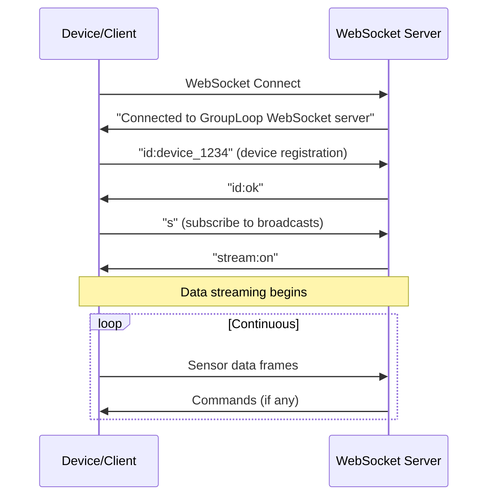
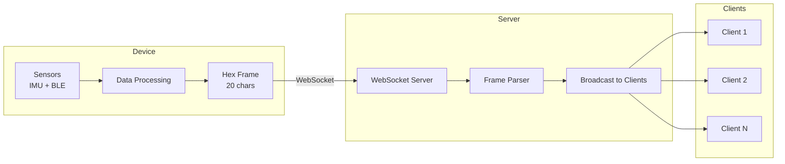

# GroupLoop Communication Protocol

This document describes the communication protocols used in the GroupLoop system, including WebSocket message formats, command protocols, and data structures.

## WebSocket Protocol

### Connection Management

Devices and clients connect to the WebSocket server using standard WebSocket protocol. The server handles both device and client connections on the same port.

**Connection Flow**:


### Message Types

#### 1. Device Registration
```
id:<device_id>
```
- **Purpose**: Register device with unique identifier
- **Response**: `id:ok` or `id:error`
- **Example**: `id:1234`

#### 2. Subscription Control
```
s
```
- **Purpose**: Subscribe to broadcast messages
- **Response**: `stream:on`
- **Usage**: Clients use this to receive device data

#### 3. Command Messages
```
cmd:<target>:<command>:<parameters>
```
- **Purpose**: Send commands to devices
- **Target**: Device ID or `all` for broadcast
- **Example**: `cmd:1234:led:ff0000`

#### 4. Sensor Data Frames
```
<20_hex_characters>
```
- **Purpose**: Device sensor data in hex format
- **Format**: Device ID (4 chars) + sensor data (16 chars)
  - Device ID: 4 hex chars (2 bytes, big-endian)
  - Accelerometer: 6 hex chars (ax, ay, az - 2 chars each)
  - BLE RSSI: 8 hex chars (dNW, dNE, dSW, dSE - 2 chars each)
  - Color state: 2 hex chars
  - Motor state: 2 hex chars
  - Reserved: 2 hex chars
- **Example**: `1234a1b2c3d4e5f678901234567890FF00AA`

#### 5. Health Check
```
ping
```
- **Purpose**: Connection health check
- **Response**: `pong`

## Command Protocol

### Command Format

Commands follow a simple `command:parameters` format:

```
<command>:<parameters>
```

### Command Registry Integration

The WebSocket server loads command definitions from the CDN server's `commands.json` file on startup. This enables dynamic command registration without server restarts.

**Command Registry Location**: `{CDN_BASE_URL}/static/commands.json`

**Registry Structure**:
```json
{
  "commands": {
    "command_name": {
      "handler": "handler_name",
      "parameters": ["param1", "param2"],
      "description": "Command description",
      "examples": ["example1", "example2"]
    }
  }
}
```

### Available Commands

Based on the command registry in `commands.json`:

#### LED Commands
- `led:<color>` - Set LED color (hex format like `ff0000`, or named colors like `red`, `green`, `blue`)
- `pattern:<pattern>` - Set LED pattern (`breathing`, `heartbeat`, `cycle`, `spring`, `off`)
- `brightness:<level>` - Set brightness (0-255)
- `reset` - Reset LED pattern
- `spring_param:<hex>` - Set spring physics parameters (6 hex chars: 2 for spring constant, 2 for damping, 2 for mass)

#### Vibration Commands
- `vibrate:<duration>` - Vibrate for specified milliseconds

#### System Commands
- `status` - Get device status information

### Command Examples

```
led:ff0000          # Set LED to red
pattern:breathing   # Set breathing pattern
brightness:128      # Set 50% brightness
vibrate:500         # Vibrate for 500ms
status              # Get device status
spring_param:10050A # Set spring parameters
```

## Data Frame Format

### Sensor Data Structure

Devices send 20-character hex strings containing:

```
<device_id><ax><ay><az><dNW><dNE><dSW><dSE><color><motor><reserved>
```

| Field | Size | Description |
|-------|------|-------------|
| device_id | 4 chars | Device identifier |
| ax | 2 chars | Accelerometer X (0-255) |
| ay | 2 chars | Accelerometer Y (0-255) |
| az | 2 chars | Accelerometer Z (0-255) |
| dNW | 2 chars | BLE beacon RSSI NW |
| dNE | 2 chars | BLE beacon RSSI NE |
| dSW | 2 chars | BLE beacon RSSI SW |
| dSE | 2 chars | BLE beacon RSSI SE |
| color | 2 chars | Current LED color state |
| motor | 2 chars | Motor state |
| reserved | 2 chars | Reserved for future use |

### Data Flow



## Error Handling

### Connection Errors
- **Connection Lost**: Automatic reconnection attempts
- **Invalid Message**: Logged and ignored
- **Unknown Command**: Error response sent

### Command Errors
- **Invalid Format**: `cmd:error:invalid_format` - Command message format is incorrect
- **Unknown Command**: `cmd:error:unknown_command` - Command not found in registry
- **Missing Parameters**: `cmd:error:missing_parameters` - Required parameters not provided
- **Command Result**: `cmd:result:<result>` - Command execution result (e.g., `cmd:result:success`, `cmd:result:sent_to_5_devices`)

### Device Errors
- **Device Not Found**: Command ignored, logged
- **Command Failed**: Error logged on device

## Security Considerations

### Current Implementation
- No authentication required
- CORS enabled for all origins
- No message encryption

### Recommended Enhancements
- Device authentication tokens
- Message signing/encryption
- Rate limiting
- Input validation

## Performance Characteristics

### Message Sizes
- **Command**: ~20-50 bytes
- **Sensor Frame**: 20 bytes (hex)
- **Status Response**: ~100-200 bytes

### Throughput
- **Device Updates**: 10-50 Hz typical
- **Command Latency**: <100ms typical
- **Concurrent Devices**: Limited by WebSocket server capacity

### Optimization Strategies
- Frame compression for high-frequency data
- Command batching for multiple devices
- Selective client subscriptions
- Data filtering on server side
