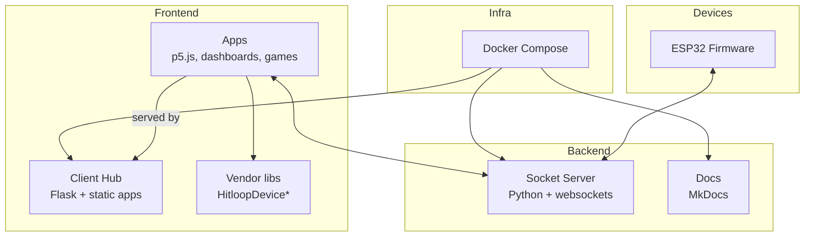
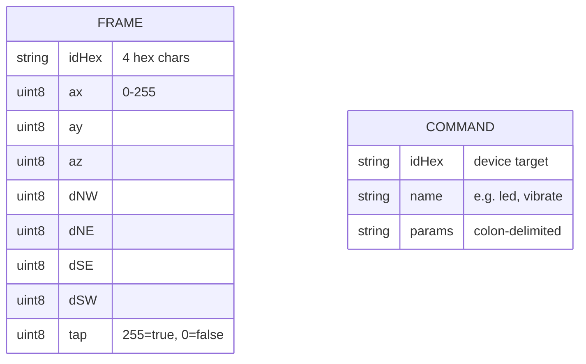

# System Architecture

This page decomposes GroupLoop into services and protocols so you can understand how sensor frames, commands, and UI flows move through the stack.

## Logical View

**Data plane**
- Devices emit fixed-length hex frames containing ID, IMU, distance sensors, and tap flag.
- Socket server fans out frames over WebSocket to any connected browser clients.
- Browser apps use `HitloopDeviceManager` to manage connections, validate commands against `commands.json`, and send back `cmd:<id>:<command>:...` strings.
- Firmware `CommandRegistry` executes the parsed commands and updates LEDs, vibration motors, or configuration.

**Control plane**
- `ProcessManager` in firmware starts/stops processes (BLE scanning, IMU sampling, Wi‑Fi, LED behaviors) based on connectivity state.
- Client hub auto-discovers app folders; landing page renders READMEs and links.

## Component Responsibilities

- **Socket server**: stateless relay, validates frame length/charset, binds on configurable host/port.
- **Client hub**: serves static apps, exposes `/config.js` with `WS_DEFAULT_URL`, `CDN_BASE_URL`, and `DEFAULT_APP`.
- **Hitloop games**: `SceneManager` routes key presses to the active `Scene`, while `HitloopDeviceManager` keeps device state fresh and prunes inactive devices.
- **Firmware**: shares a single `WebSocketManager` for outbound commands and inbound frames; `Process` subclasses isolate concerns (LED, vibration, IMU, BLE).

## Message Formats

!!! tip "Keep the frames tight"
    Frames are sliced to 20 hex characters before parsing. If you add fields, align client and firmware parsers and update `commands.json` plus any data visualizations.

