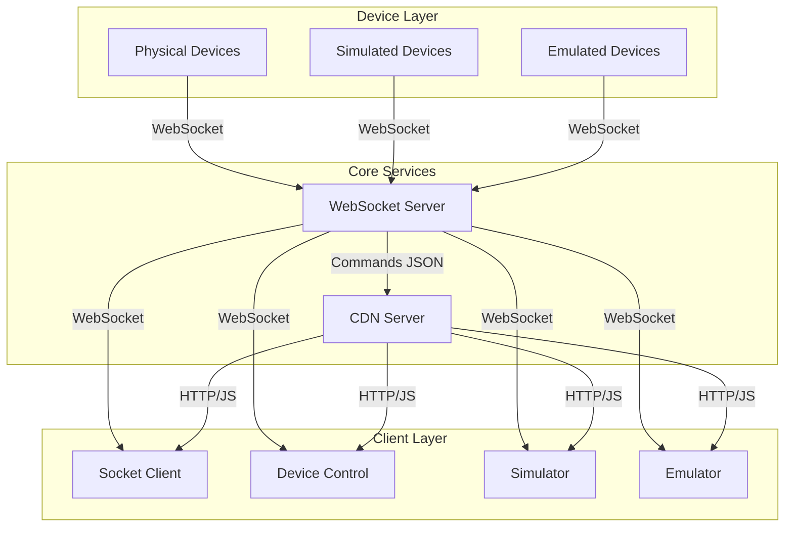

# GroupLoop Services

This document provides detailed information about each service in the GroupLoop ecosystem, their purpose, configuration, and dependencies.

## Core Services

### WebSocket Server (`socket-server`)

**Purpose**: Central communication hub that manages device connections and message routing.

**Port**: 5003 (external) → 5000 (internal)

**Technology**: Python `websockets` library (asyncio-based WebSocket server)

**Key Features**:
- Device registration and management
- Command routing and execution via command registry
- Real-time message broadcasting to subscribers
- Command registry integration (loads from CDN on startup)
- Device and client connection tracking
- Automatic stale connection cleanup

**Configuration**:
```yaml
environment:
  - WS_HOST=0.0.0.0
  - WS_PORT=5000
  - PYTHONUNBUFFERED=1
  - CDN_BASE_URL=http://cdn.hitloop.feib.nl
```

**Dependencies**:
- Loads command definitions from CDN server (`/static/commands.json`)
- Manages device and client WebSocket connections
- Uses `aiohttp` for HTTP requests to CDN

**Protocol Support**:
- WebSocket connections for devices and clients
- Device registration: `id:<device_id>`
- Subscription: `s` (clients subscribe to receive broadcasts)
- Commands: `cmd:<target>:<command>:<parameters>`
- Health check: `ping` → `pong`

### CDN Server (`cdn-server`)

**Purpose**: Serves shared JavaScript libraries, firmware files, and command definitions.

**Port**: 5008 (external) → 5000 (internal)

**Key Features**:
- Static file serving with CORS support
- Command registry JSON endpoint
- Firmware file distribution
- JavaScript library hosting

**Endpoints**:
- `/js/<filename>` - JavaScript libraries (e.g., `p5.min.js`, `HitloopDevice.js`)
- `/firmware/<filename>` - Firmware files
- `/static/commands.json` - Command definitions (loaded by WebSocket server on startup)

**Dependencies**:
- None (standalone service)

## Client Services

### Socket Client (`socket-client`)

**Purpose**: Reference web UI for observing device state and sending commands.

**Port**: 5004 (external) → 5000 (internal)

**Key Features**:
- Real-time device monitoring
- Command interface
- Device status visualization
- WebSocket connection management

**Dependencies**:
- WebSocket Server (for device communication)
- CDN Server (for shared libraries)

**Configuration**:
```yaml
environment:
  - WS_DEFAULT_URL=${WS_DEFAULT_URL:-ws://feib.nl:5003}
  - CDN_BASE_URL=${CDN_BASE_URL:-http://cdn.hitloop.feib.nl}
```

### Device Control (`device-control`)

**Purpose**: Advanced device control interface with enhanced features.

**Port**: 5009 (external) → 5000 (internal)

**Key Features**:
- Device management interface
- Batch command execution
- Device configuration
- Advanced monitoring tools

**Dependencies**:
- WebSocket Server (for device communication)
- CDN Server (for shared libraries)

### Socket Simulator (`socket-simulator`)

**Purpose**: Simulates a swarm of virtual devices for load testing and development.

**Port**: 5005 (external) → 5000 (internal)

**Key Features**:
- Virtual device generation
- Realistic sensor data simulation
- Load testing capabilities
- Development without hardware

**Dependencies**:
- WebSocket Server (for connection)
- CDN Server (for shared libraries)

### Device Emulator (`device-emulator`)

**Purpose**: Mobile-friendly emulator for creating virtual devices.

**Port**: 5007 (external) → 5000 (internal)

**Key Features**:
- Mobile-optimized interface
- Virtual device creation
- Touch-based interaction
- Device behavior simulation

**Dependencies**:
- WebSocket Server (for connection)
- CDN Server (for shared libraries)

## Development Services

### Documentation (`docs`)

**Purpose**: MkDocs-based documentation site with architecture and guides.

**Port**: 5006 (external) → 5000 (internal)

**Key Features**:
- Material Design theme
- Mermaid diagram support
- Search functionality
- Responsive design

**Dependencies**:
- None (standalone service)

## Service Communication Patterns



## Environment Variables

### Global Configuration
- `WS_DEFAULT_URL`: Default WebSocket server URL (default: `ws://feib.nl:5003`)
- `CDN_BASE_URL`: CDN server base URL (default: `http://cdn.hitloop.feib.nl`)

### Service-Specific Configuration
- `WS_HOST`: WebSocket server bind address (default: `0.0.0.0`)
- `WS_PORT`: WebSocket server port (default: `5000`)
- `PYTHONUNBUFFERED`: Python output buffering (set to `1`)

## Service Health and Monitoring

Each service provides health endpoints and logging:

- **WebSocket Server**: `ping`/`pong` WebSocket messages for health checks, connection logging with labels
- **CDN Server**: Service status in root response
- **Client Services**: Built-in connection status monitoring
- **Documentation**: Static site, no health checks needed

**WebSocket Server Logging**:
- Connection events: `[CONNECT]`, `[DISCONNECT]`, `[DEVICE_DISCONNECT]`
- Command execution: `[SEND]`, `[BROADCAST]`, `[COMMANDS]`
- Errors: `[ERROR]` with detailed messages

## Scaling Considerations

- **WebSocket Server**: Can be scaled horizontally with load balancing
- **CDN Server**: Can use CDN providers or multiple instances
- **Client Services**: Stateless, easily scalable
- **Device Connections**: Limited by WebSocket server capacity
