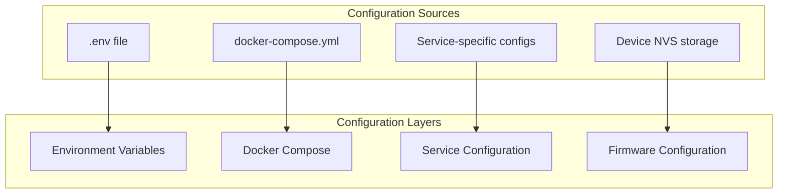

# GroupLoop Configuration Guide

This document explains how to configure the GroupLoop system for different environments and use cases.

## Configuration Overview

GroupLoop uses a multi-layered configuration system:



## Environment Variables

### Global Configuration

Create a `.env` file in the project root:

```bash
# .env file
# WebSocket server configuration
WS_DEFAULT_URL=ws://localhost:5003
CDN_BASE_URL=http://localhost:5008

# Optional: Override default ports
SOCKET_PORT=5003
CLIENT_PORT=5004
SIMULATOR_PORT=5005
DOCS_PORT=5006
EMULATOR_PORT=5007
CDN_PORT=5008
CONTROL_PORT=5009
```

### Service-Specific Variables

```bash
# WebSocket server
WS_HOST=0.0.0.0
WS_PORT=5000
PYTHONUNBUFFERED=1

# CDN server
CDN_BASE_URL=http://localhost:5008

# Client services
WS_DEFAULT_URL=ws://localhost:5003
CDN_BASE_URL=http://localhost:5008
```

## Docker Compose Configuration

### Basic Configuration

```yaml
# docker-compose.yml
version: '3.8'

x-ws-env: &ws_env
  WS_DEFAULT_URL: ${WS_DEFAULT_URL:-ws://feib.nl:5003}

x-cdn-env: &cdn_env
  CDN_BASE_URL: ${CDN_BASE_URL:-http://cdn.hitloop.feib.nl}

services:
  socket:
    build:
      context: ./socket-server
      dockerfile: Dockerfile
    ports:
      - "${SOCKET_PORT:-5003}:5000"
    environment:
      - WS_HOST=0.0.0.0
      - WS_PORT=5000
      - PYTHONUNBUFFERED=1
```

### Advanced Configuration

```yaml
# docker-compose.override.yml
version: '3.8'

services:
  socket:
    environment:
      - DEBUG=1
      - LOG_LEVEL=debug
    volumes:
      - ./logs:/app/logs
    restart: unless-stopped
    
  client:
    environment:
      - WS_DEFAULT_URL=ws://localhost:5003
      - CDN_BASE_URL=http://localhost:5008
    restart: unless-stopped
    
  cdn_server:
    volumes:
      - ./custom-assets:/app/static/custom
    restart: unless-stopped
```

## Service Configuration

### WebSocket Server Configuration

```python
# socket-server/app/app.py
import os
import asyncio
import websockets

# Configuration from environment
WS_HOST = os.environ.get("WS_HOST", "0.0.0.0")
WS_PORT = int(os.environ.get("WS_PORT", "5000"))
PYTHONUNBUFFERED = os.environ.get("PYTHONUNBUFFERED", "1")

# CDN configuration for command registry
CDN_BASE_URL = os.environ.get("CDN_BASE_URL", "http://cdn.hitloop.feib.nl")

# Health checks are done via WebSocket ping/pong messages
# No HTTP /health endpoint - use WebSocket ping for health checks
```

### Client Configuration

```javascript
// Client-side configuration
const config = {
    wsUrl: process.env.WS_DEFAULT_URL || 'ws://localhost:5003',
    cdnUrl: process.env.CDN_BASE_URL || 'http://localhost:5008',
    reconnectInterval: 5000,
    maxReconnectAttempts: 10
};
```

## Network Configuration

### Port Configuration

| Service | Default Port | Environment Variable | Description |
|---------|--------------|---------------------|-------------|
| WebSocket Server | 5003 | SOCKET_PORT | Main communication hub |
| Client UI | 5004 | CLIENT_PORT | Device monitoring interface |
| Simulator | 5005 | SIMULATOR_PORT | Virtual device simulator |
| Documentation | 5006 | DOCS_PORT | Documentation site |
| Device Emulator | 5007 | EMULATOR_PORT | Mobile device emulator |
| CDN Server | 5008 | CDN_PORT | Static file server |
| Device Control | 5009 | CONTROL_PORT | Advanced device control |

### Custom Port Configuration

```bash
# .env file
SOCKET_PORT=8080
CLIENT_PORT=8081
CDN_PORT=8082
```

### Firewall Configuration

```bash
# UFW (Ubuntu)
sudo ufw allow 5003/tcp  # WebSocket server
sudo ufw allow 5004/tcp  # Client UI
sudo ufw allow 5008/tcp  # CDN server

# iptables
iptables -A INPUT -p tcp --dport 5003 -j ACCEPT
iptables -A INPUT -p tcp --dport 5004 -j ACCEPT
iptables -A INPUT -p tcp --dport 5008 -j ACCEPT
```

## SSL/TLS Configuration

### Reverse Proxy Setup

```nginx
# nginx.conf
server {
    listen 443 ssl;
    server_name your-domain.com;
    
    ssl_certificate /path/to/certificate.crt;
    ssl_certificate_key /path/to/private.key;
    
    location /socket/ {
        proxy_pass http://localhost:5003/;
        proxy_http_version 1.1;
        proxy_set_header Upgrade $http_upgrade;
        proxy_set_header Connection "upgrade";
        proxy_set_header Host $host;
    }
    
    location /client/ {
        proxy_pass http://localhost:5004/;
    }
    
    location /cdn/ {
        proxy_pass http://localhost:5008/;
    }
}
```

### Docker Compose with SSL

```yaml
# docker-compose.ssl.yml
version: '3.8'

services:
  nginx:
    image: nginx:alpine
    ports:
      - "443:443"
    volumes:
      - ./nginx.conf:/etc/nginx/nginx.conf
      - ./ssl:/etc/nginx/ssl
    depends_on:
      - socket
      - client
      - cdn_server
```

## Database Configuration

### Redis for Session Storage

```yaml
# docker-compose.redis.yml
version: '3.8'

services:
  redis:
    image: redis:alpine
    ports:
      - "6379:6379"
    volumes:
      - redis_data:/data
    command: redis-server --appendonly yes

  socket:
    environment:
      - REDIS_URL=redis://redis:6379
    depends_on:
      - redis

volumes:
  redis_data:
```

### PostgreSQL for Data Persistence

```yaml
# docker-compose.postgres.yml
version: '3.8'

services:
  postgres:
    image: postgres:13
    environment:
      - POSTGRES_DB=grouploop
      - POSTGRES_USER=grouploop
      - POSTGRES_PASSWORD=password
    ports:
      - "5432:5432"
    volumes:
      - postgres_data:/var/lib/postgresql/data

volumes:
  postgres_data:
```

## Monitoring Configuration

### Health Checks

```yaml
# docker-compose.health.yml
version: '3.8'

services:
  socket:
    # Note: WebSocket server uses ping/pong for health checks
    # Docker healthcheck would need a WebSocket client tool
    # For now, monitor via logs or use external monitoring
    healthcheck:
      test: ["CMD-SHELL", "python3 -c 'import websockets; import asyncio; asyncio.run(websockets.connect(\"ws://localhost:5000\"))' || exit 1"]
      interval: 30s
      timeout: 10s
      retries: 3
      start_period: 40s
      
  client:
    healthcheck:
      test: ["CMD", "curl", "-f", "http://localhost:5000/"]
      interval: 30s
      timeout: 10s
      retries: 3
```

### Logging Configuration

```yaml
# docker-compose.logging.yml
version: '3.8'

services:
  socket:
    logging:
      driver: "json-file"
      options:
        max-size: "10m"
        max-file: "3"
        
  client:
    logging:
      driver: "json-file"
      options:
        max-size: "5m"
        max-file: "2"
```

## Production Configuration

### Production Environment

```bash
# .env.production
WS_DEFAULT_URL=wss://your-domain.com/socket
CDN_BASE_URL=https://your-domain.com/cdn
DEBUG=0
LOG_LEVEL=warning
```

### Production Docker Compose

```yaml
# docker-compose.prod.yml
version: '3.8'

services:
  socket:
    restart: unless-stopped
    environment:
      - DEBUG=0
      - LOG_LEVEL=warning
    logging:
      driver: "json-file"
      options:
        max-size: "10m"
        max-file: "5"
        
  client:
    restart: unless-stopped
    logging:
      driver: "json-file"
      options:
        max-size: "5m"
        max-file: "3"
```

## Firmware Configuration

### Device Configuration

```cpp
// Firmware configuration
const String DEFAULT_WIFI_SSID = "YourNetwork";
const String DEFAULT_WIFI_PASSWORD = "YourPassword";
const String DEFAULT_SOCKET_SERVER_URL = "ws://your-server:5003";
const int DEFAULT_LED_PIN = 3;
const int DEFAULT_MOTOR_PIN = 2;
```

### Configuration via WebSocket

```javascript
// Send configuration to device
const config = {
    wifiSSID: "NewNetwork",
    wifiPassword: "NewPassword",
    socketServerURL: "ws://new-server:5003"
};

socket.emit('config', JSON.stringify(config));
```

## Configuration Validation

### Environment Validation

```bash
#!/bin/bash
# validate-config.sh

# Check required environment variables
required_vars=("WS_DEFAULT_URL" "CDN_BASE_URL")
for var in "${required_vars[@]}"; do
    if [ -z "${!var}" ]; then
        echo "Error: $var is not set"
        exit 1
    fi
done

# Validate URLs
if [[ ! $WS_DEFAULT_URL =~ ^wss?:// ]]; then
    echo "Error: WS_DEFAULT_URL must start with ws:// or wss://"
    exit 1
fi

if [[ ! $CDN_BASE_URL =~ ^https?:// ]]; then
    echo "Error: CDN_BASE_URL must start with http:// or https://"
    exit 1
fi

echo "Configuration validation passed"
```

### Docker Compose Validation

```bash
# Validate docker-compose.yml
docker-compose config

# Validate with specific file
docker-compose -f docker-compose.prod.yml config
```

## Configuration Management

### Configuration Templates

```bash
# config-templates/
├── development.env
├── staging.env
├── production.env
└── local.env
```

### Configuration Deployment

```bash
#!/bin/bash
# deploy-config.sh

ENVIRONMENT=$1
CONFIG_FILE="config-templates/${ENVIRONMENT}.env"

if [ ! -f "$CONFIG_FILE" ]; then
    echo "Error: Configuration file $CONFIG_FILE not found"
    exit 1
fi

cp "$CONFIG_FILE" .env
echo "Configuration deployed for $ENVIRONMENT"
```

## Best Practices

### 1. Security

- Never commit sensitive data to version control
- Use environment variables for secrets
- Implement proper access controls
- Regular security audits

### 2. Environment Separation

- Use different configurations for dev/staging/prod
- Separate database instances
- Use different domain names
- Implement proper backup strategies

### 3. Monitoring

- Set up health checks
- Monitor resource usage
- Log important events
- Set up alerts for failures

### 4. Maintenance

- Regular configuration reviews
- Update dependencies
- Test configuration changes
- Document configuration changes

## Troubleshooting

### Configuration Issues

```bash
# Check environment variables
docker-compose config

# Check service logs
docker-compose logs <service-name>

# Test configuration
docker-compose up --dry-run
```

### Common Problems

1. **Port Conflicts**: Check if ports are already in use
2. **Environment Variables**: Verify all required variables are set
3. **Network Issues**: Check firewall and network configuration
4. **SSL Issues**: Verify certificate configuration
5. **Permission Issues**: Check file permissions and ownership
