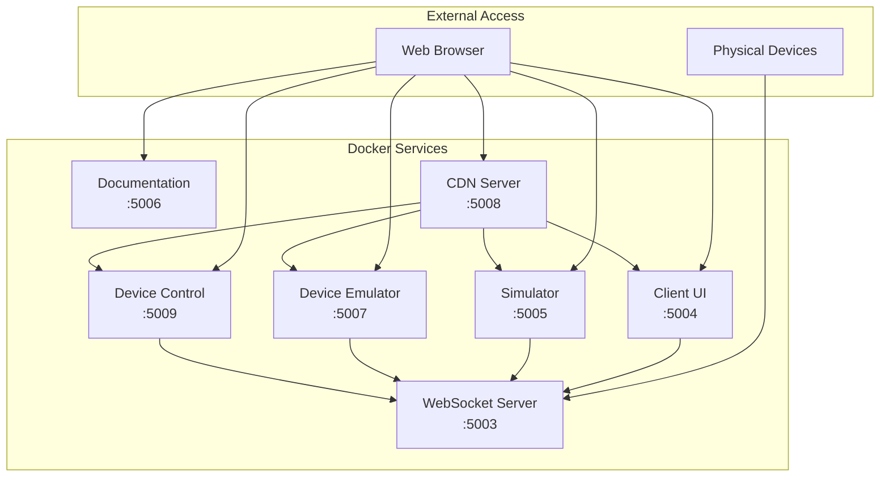

# GroupLoop Quick Start Guide

This guide will get you up and running with the GroupLoop system in minutes using Docker Compose.

## Prerequisites

- **Docker**: Version 20.10 or later
- **Docker Compose**: Version 2.0 or later
- **Git**: For cloning the repository
- **Web Browser**: For accessing the web interfaces

### Installation Check

```bash
# Check Docker installation
docker --version
docker-compose --version

# Expected output:
# Docker version 20.10.x
# Docker Compose version 2.x.x
```

## Quick Start

### 1. Clone the Repository

```bash
git clone <repository-url>
cd grouploop
```

### 2. Start All Services

```bash
# Start all services with Docker Compose
docker-compose up --build

# Or run in background
docker-compose up --build -d
```

### 3. Access the Services

Once all services are running, you can access them at:

| Service | URL | Description |
|---------|-----|-------------|
| **Documentation** | http://localhost:5006 | This documentation site |
| **Client UI** | http://localhost:5004 | Device monitoring interface |
| **Device Control** | http://localhost:5009 | Advanced device control |
| **Simulator** | http://localhost:5005 | Virtual device simulator |
| **Device Emulator** | http://localhost:5007 | Mobile device emulator |
| **CDN Server** | http://localhost:5008 | Static file server |

### 4. Verify Installation

```bash
# Check service status
docker-compose ps

# Expected output shows all services as "Up"
```

## Service Architecture



## First Steps

### 1. Explore the Documentation

Visit http://localhost:5006 to read the complete documentation and understand the system architecture.

### 2. Try the Simulator

1. Go to http://localhost:5005
2. Click "Start Simulation" to create virtual devices
3. Watch the real-time data stream
4. Try sending commands to the simulated devices

### 3. Use the Client UI

1. Go to http://localhost:5004
2. Connect to the WebSocket server
3. Monitor device data (if any devices are connected)
4. Send commands to connected devices

### 4. Test Device Emulator

1. Go to http://localhost:5007
2. Create a virtual device
3. Send commands to your virtual device
4. Observe the device behavior

## Environment Configuration

### Default Configuration

The system uses these default settings:

```yaml
# Environment variables
WS_DEFAULT_URL: ws://feib.nl:5003
CDN_BASE_URL: http://cdn.hitloop.feib.nl
```

### Custom Configuration

Create a `.env` file in the project root to override defaults:

```bash
# .env file
WS_DEFAULT_URL=ws://localhost:5003
CDN_BASE_URL=http://localhost:5008
```

## Stopping the Services

```bash
# Stop all services
docker-compose down

# Stop and remove volumes
docker-compose down -v

# Stop and remove images
docker-compose down --rmi all
```

## Troubleshooting

### Common Issues

#### 1. Port Conflicts

If you get port binding errors:

```bash
# Check what's using the ports
netstat -tulpn | grep :5003
netstat -tulpn | grep :5004

# Kill processes using the ports
sudo kill -9 <PID>
```

#### 2. Docker Build Failures

```bash
# Clean Docker cache
docker system prune -a

# Rebuild without cache
docker-compose build --no-cache
```

#### 3. Service Not Starting

```bash
# Check service logs
docker-compose logs <service-name>

# Example:
docker-compose logs socket
docker-compose logs client
```

#### 4. WebSocket Connection Issues

- Ensure the WebSocket server is running on port 5003
- Check browser console for connection errors
- Verify firewall settings

### Service Health Checks

```bash
# Check WebSocket server (uses ping/pong via WebSocket, not HTTP)
# Use a WebSocket client or check logs:
docker-compose logs socket

# Check CDN server
curl http://localhost:5008/

# Check service status
docker-compose ps
```

## Next Steps

### 1. Connect Physical Devices

- Flash the firmware to ESP32-C3 devices
- Configure WiFi settings
- Connect devices to the WebSocket server

### 2. Customize Configuration

- Modify environment variables
- Update command registry
- Customize client interfaces

### 3. Develop New Features

- Add new processes to firmware
- Create new client applications
- Extend the command system

### 4. Production Deployment

- Set up proper domain names
- Configure SSL certificates
- Implement authentication
- Set up monitoring and logging

## Development Mode

For development, you can run services individually:

```bash
# Run only the WebSocket server
docker-compose up socket

# Run only the client UI
docker-compose up client

# Run with live reloading
docker-compose up --build
```

## Performance Considerations

### Resource Usage

| Service | CPU | Memory | Network |
|---------|-----|--------|---------|
| WebSocket Server | Low | ~50MB | High |
| Client UI | Low | ~30MB | Medium |
| Simulator | Medium | ~40MB | Medium |
| CDN Server | Low | ~20MB | Low |

### Scaling

- **WebSocket Server**: Can handle 100+ concurrent connections
- **Client Services**: Stateless, easily scalable
- **CDN Server**: Can use external CDN providers

## Security Notes

⚠️ **Important**: This is a development setup with no authentication or encryption. For production use:

- Implement proper authentication
- Use HTTPS/WSS for secure connections
- Set up firewall rules
- Regular security updates
- Monitor for vulnerabilities

## Support

If you encounter issues:

1. Check the troubleshooting section above
2. Review service logs: `docker-compose logs`
3. Consult the full documentation
4. Check the project repository for known issues
5. Create an issue with detailed error information
