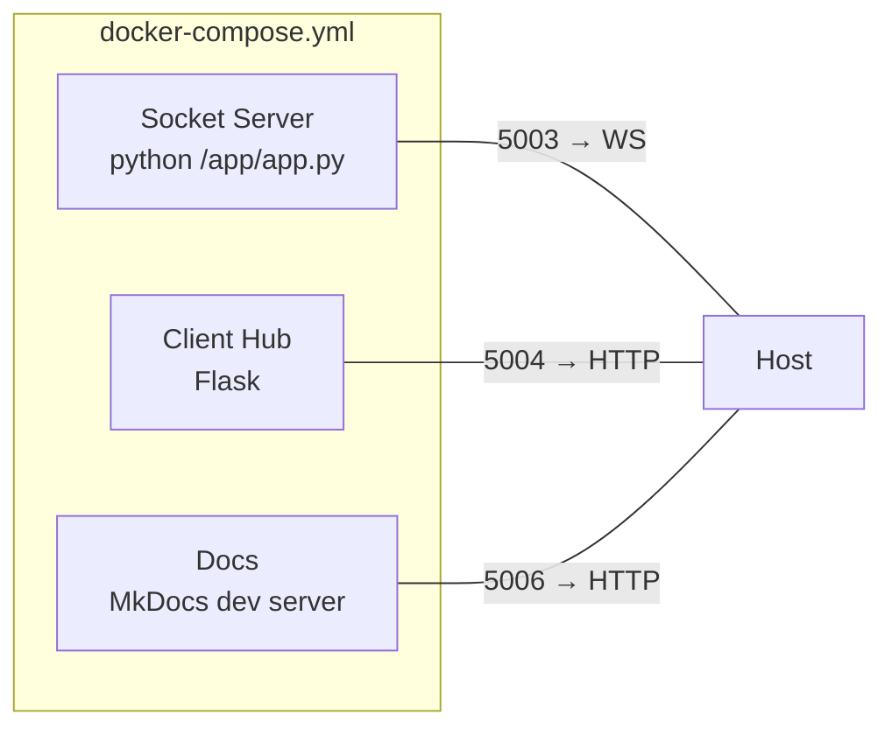

# Deployment Structure

GroupLoop ships with a small Docker Compose stack. Each container is rebuildable locally and portable to any host that supports Docker.



## Services (see `docker-compose.yml`)

| Service | Port (host:container) | Context | Purpose |
| --- | --- | --- | --- |
| `socket` | `5003:5000` | `./socket-server` | WebSocket relay between devices and browsers. |
| `client_hub` | `5004:5000` | `./client-hub` | Serves all apps under `app/static/apps/<name>`. |
| `docs` | `5006:5000` | `./documentation` | Live MkDocs preview with Mermaid enabled. |

!!! note "Volumes"
    Each service mounts its source folder (`./socket-server:/app`, `./client-hub:/app`, `./documentation:/site`) so code edits are reflected without rebuilds during development.

## Key Environment Variables

| Variable | Default | Used by | Description |
| --- | --- | --- | --- |
| `WS_DEFAULT_URL` | `wss://ws.grouploop.feib.nl` | client_hub | Default WebSocket endpoint injected via `/config.js`. |
| `CDN_BASE_URL` | `https://cdn.hitloop.feib.nl` | client_hub | Base URL for shared assets/commands.json. |
| `DEFAULT_APP` | _(empty)_ | client_hub | When set, `/` redirects directly to that app folder. |
| `WS_HOST` | `0.0.0.0` | socket | Bind address for WebSocket server. |
| `WS_PORT` | `5000` | socket | Container WebSocket port. |

## Local Bring-up

```bash
docker compose up --build
# visit: http://localhost:5004 for client hub
#        http://localhost:5006 for docs
#        ws://localhost:5003 for WebSocket relay
```

!!! warning "WS URL in browsers"
    If you expose the socket server over TLS or a reverse proxy, update `WS_DEFAULT_URL` accordingly to avoid mixed-content errors (browsers block `ws://` when the page is served via `https://`).

