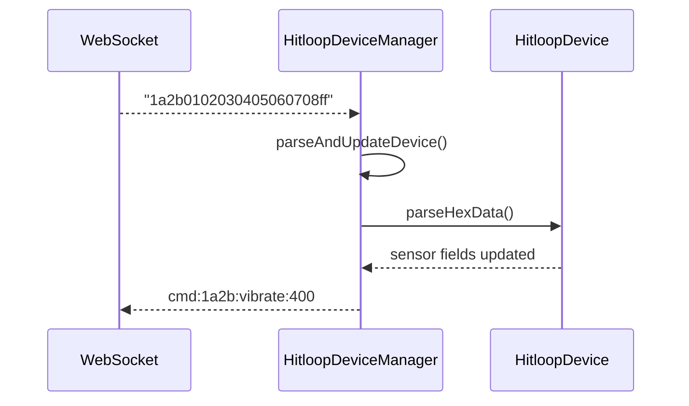

# Browser API Reference

This page documents the shared vendor classes exposed at `app/static/vendor/js/`.

## `HitloopDevice`

Represents a single device and knows how to parse hex frames and send commands.

| Member | Description |
| --- | --- |
| `constructor(id, color=[255,255,255], motorState=false)` | Create a device shell with defaults. |
| `setWebSocket(ws)` | Attach an open `WebSocket` instance. |
| `setCommandsConfig(commandsConfig)` | Provide the parsed `commands.json` object. |
| `parseHexData(hexString)` | Validates 20-char hex frames and updates sensor fields (`ax`, `ay`, `az`, `dNW/dNE/dSE/dSW`, `tap`). Returns `true/false`. |
| `getSensorData()` | Returns `{ id, ax, ay, az, dNW, dNE, dSW, tap, color, motorState }`. |
| `validateCommand(command, params)` | Checks existence and parameter count + value validation for `brightness`, `spring_param`, `vibrate`. |
| `sendCommand(command, ...params)` | Formats `cmd:<id>:<command>:<params>` and sends over WebSocket; updates local state via `updateLocalState`. |
| `sendCommandWithParam(command, param)` | Convenience wrapper. |
| `sendCommandNoParams(command)` | Convenience wrapper. |
| `parseColor(color)` | Converts named colors or `#RRGGBB` into `[r,g,b]` (defaults to white). |

!!! example "Send a command"
    ```js
    const device = manager.getDevice('1a2b');
    if (device) {
      device.sendCommand('led', '#00ffaa');
      device.sendCommandWithParam('vibrate', 400);
    }
    ```

## `HitloopDeviceManager`

Manages multiple devices and the shared WebSocket connection.

| Member | Description |
| --- | --- |
| `constructor(websocketUrl)` | Store URL; no connection yet. |
| `connect()` | Opens WebSocket, loads `commands.json` (from CDN), starts prune interval. |
| `disconnect()` | Closes WebSocket and clears prune timer. |
| `handleMessage(data)` | Splits batched frames by newline and passes to `parseAndUpdateDevice`. |
| `parseAndUpdateDevice(hexString)` | Validates 20-char frames, creates devices on first sight, updates existing ones, and timestamps `lastSeen`. |
| `addDevice(device)` / `removeDevice(id)` | Manually manage device map. |
| `getDevice(id)` / `getAllDevices()` / `getDeviceCount()` | Accessors. |
| `pruneInactive()` | Removes devices silent for `inactiveTimeoutMs` (default 5000 ms). |
| `sendCommandToDevice(id, command, ...params)` | Delegates to the device. |
| `sendCommandToAll(command, ...params)` | Broadcast to every managed device. |
| `getAvailableCommands()` / `getCommandInfo(command)` / `isValidCommand(command)` | Reads from `commandsConfig`. |



!!! note "commands.json source"
    `connect()` fetches `https://cdn.hitloop.feib.nl/static/commands.json` by default. Call `setCommandsConfig()` first if you need an offline or custom set during development.

## Usage Pattern

```js
const manager = new HitloopDeviceManager(APP_CONFIG.wsDefaultUrl);
await manager.connect();

// react to new data
setInterval(() => {
  for (const [id, device] of manager.getAllDevices()) {
    console.log(id, device.getSensorData());
  }
}, 500);

// send a broadcast
manager.sendCommandToAll('led', '#ff8800');
```

