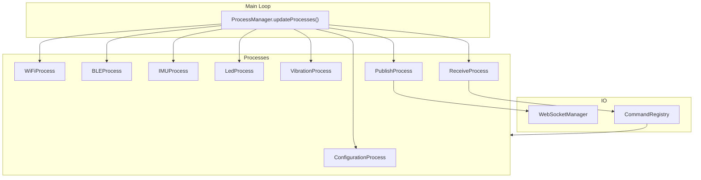
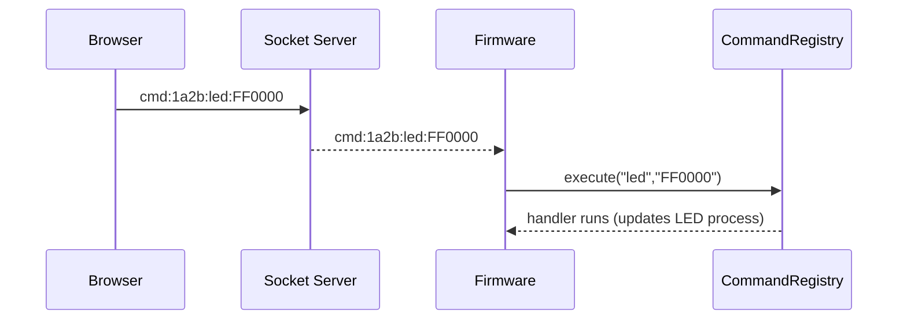
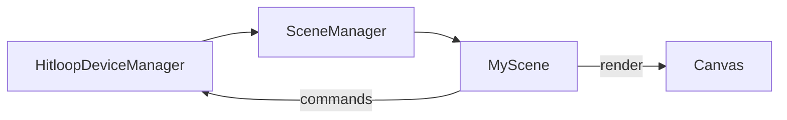

# Extending the System

This page collects the most common extension points: firmware processes/commands, new client apps, and new Hitloop game scenes.

## Extending the Firmware

The firmware is process-driven (`include/processes/*.h`, `src/*.cpp`) and uses a shared `CommandRegistry`.



### Add a Process
1. Create `include/processes/MyProcess.h` and `src/MyProcess.cpp` deriving from `Process`.
2. Implement `setup()` and `update()`; guard work with `if (!isProcessRunning()) return;`.
3. In `setup()` add any callbacks (e.g., register command handlers, attach to timers).
4. Register the process in `src/main.cpp`:
   ```cpp
   processManager.addProcess("myProcess", new MyProcess());
   ```
5. Start/stop via `processManager.startProcess("myProcess")` or `haltProcess(...)`.

!!! tip "Keep setup idempotent"
    `ProcessManager.setupProcesses()` runs once during boot. Avoid side effects that assume other processes are already running—check dependencies explicitly.

### Add a Command
1. In the relevant process (or globally in `registerGlobalCommands()`), call `commandRegistry.registerCommand("name", handler);`.
2. Handlers receive a `String parameters` segment (everything after `cmd:<id>:<command>:`).
3. Validate and act; log failures with `Serial.println` for clarity.
4. If the command toggles LEDs or vibration, also update local state so subsequent status prints are accurate.



## Adding a New Client Application

Each app lives under `client-hub/app/static/apps/<name>`.

1. Create a folder with `index.html` plus any JS/CSS/assets.
2. Link assets relatively (`./client.js`, `./style.css`). Shared libs are at `/static/vendor/js/`.
3. Optionally add a `README.md`; it is rendered on the landing page card.
4. Restart `client_hub` (or `docker compose up client_hub`) — the landing page auto-discovers the new folder.
5. Access at `http://localhost:5004/apps/<name>/`.

!!! note "Config injection"
    `/config.js` exposes `window.APP_CONFIG` with `wsDefaultUrl`, `cdnBaseUrl`, and `appsBaseUrl`. Use it to avoid hardcoding endpoints.

## Adding a Hitloop Games Scene

Scenes live in `client-hub/app/static/apps/hitloop-games/scenes/` and inherit from `Scene`.

1. Create `scenes/MyScene.js`:
   ```js
   class MyScene extends Scene {
     setup() { /* preload or reset state */ }
     draw() { /* render per frame */ }
     keyPressed() { super.keyPressed(); /* handle keys */ }
   }
   ```
2. Register it in `sketch.js`:
   ```js
   sceneManager.addScene('myScene', new MyScene(deviceManager));
   // Optionally switchTo('myScene') as the default
   ```
3. Use `this.deviceManager` to read live device data:
   ```js
   const d = this.deviceManager.getDevice('1a2b');
   if (d) {
     const { ax, ay, tap } = d.getSensorData();
     // drive visuals based on sensor values
   }
   ```
4. Implement `drawDebugText()` and toggle with the `d` key when you need on-screen diagnostics.



!!! warning "Pruning behavior"
    `HitloopDeviceManager` prunes devices after 5 seconds of silence. If you simulate devices, send frames at least every 5 seconds to avoid auto-removal.

