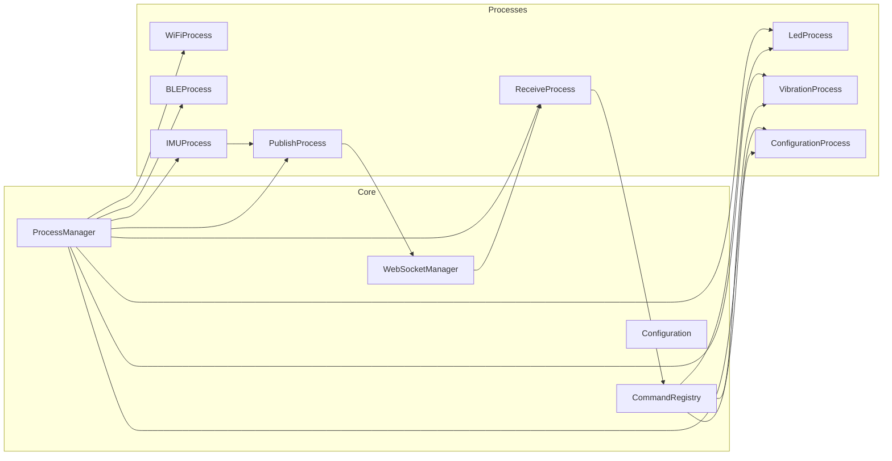
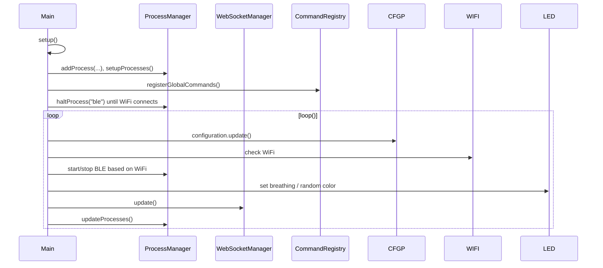

# Firmware Architecture

The firmware runs on ESP32 hardware and is organized around small `Process` subclasses coordinated by a `ProcessManager`. A single `WebSocketManager` shares network connectivity, while `CommandRegistry` routes incoming commands to handlers.

## High-level Diagram

## Lifecycle (`src/main.cpp`)

## Key Components

- **ProcessManager** (`include/ProcessManager.h`): holds a map of named processes, handles start/halt/setup/update. All processes must check `isProcessRunning()` before doing work.
- **Processes**:
  - `WiFiProcess`: manages Wi‑Fi connectivity; gates BLE startup.
  - `BLEProcess`: scans for beacons; can be halted when offline.
  - `IMUProcess`: captures accelerometer data.
  - `LedProcess`: orchestrates LED behaviors (`ledsBreathing`, random colors on Wi‑Fi connect).
  - `VibrationProcess`: triggers haptics for commands/events.
  - `PublishProcess`: packages sensor readings for outbound frames.
  - `ReceiveProcess`: listens for inbound WebSocket text/bin and forwards commands to `CommandRegistry`.
  - `ConfigurationProcess`: handles configuration mode and persistence.
- **WebSocketManager** (`include/WebSocketManager.h`): parses the `ws://host:port/path` URL, reconnects every 5s if needed, and exposes `sendMessage`, `hasMessage`, `getMessage`.
- **CommandRegistry** (`include/CommandRegistry.h`): maps command strings to handlers; used both globally (`registerGlobalCommands`) and by specific processes.

!!! tip "Stateful LEDs"
    When handling commands that change LEDs or vibration, update local state so diagnostics (`status` command) reflect reality.

## Adding Features Safely

1. Create a new `Process` when you need periodic work or lifecycle hooks; avoid bloating existing ones.
2. Use `commandRegistry.registerCommand` for any external control surface—keep parsing/validation close to the handler.
3. Keep message formats stable: outbound frames are trimmed to 20 hex characters; if you add fields, update both the client parsers (`HitloopDevice.parseHexData`) and the server relay if needed.
4. Maintain non-blocking `loop()`; heavy tasks should be chunked across iterations or offloaded to timers.

