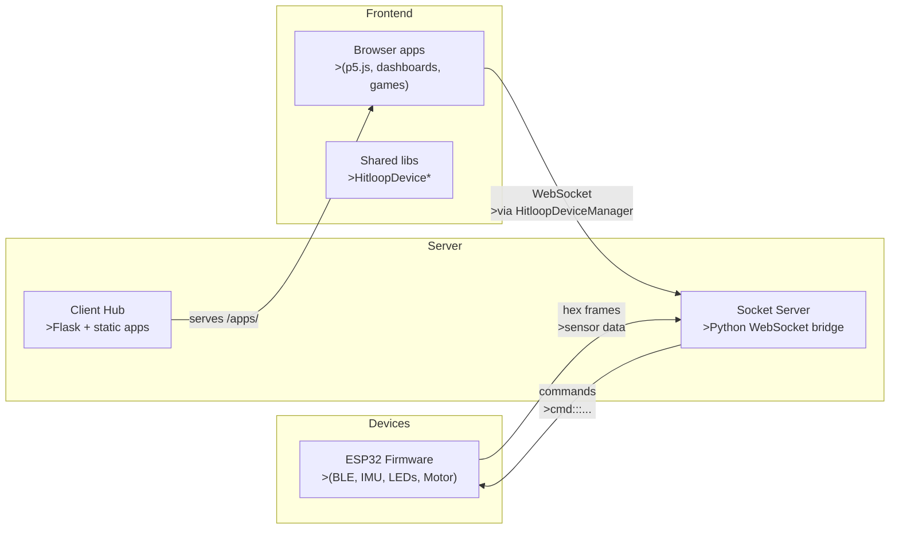
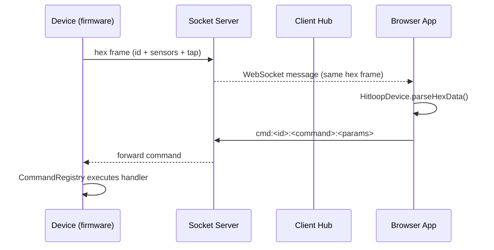
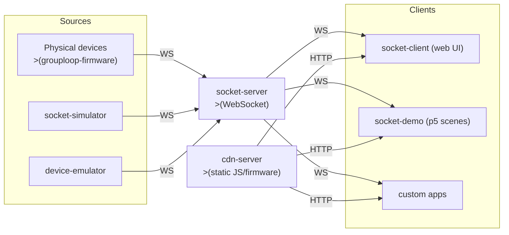
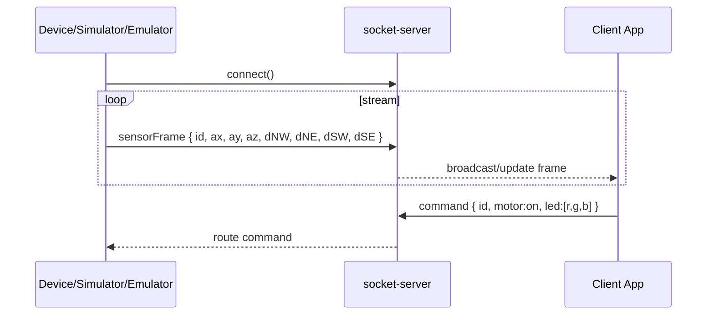

--- 
title: GroupLoop Documentation
---

# GroupLoop Overview

GroupLoop links custom wearable devices to interactive browser experiences and real-time data visualisations. The stack is intentionally lightweight: a Python WebSocket bridge, a Flask “client hub” that serves web apps, and firmware running on each device that speaks the same command/data protocol.

!!! note "What this page covers"
    - What lives in this repository  
    - How data flows end-to-end  
    - Where to look for more detail in the sections below

## System at a Glance



## Key Pieces

- **Firmware** (`grouploop-firmware/`): modular processes for BLE scanning, IMU sampling, LED and vibration control, Wi‑Fi + WebSocket connectivity, and a command registry.
- **Socket server** (`socket-server/`): Python WebSocket endpoint that relays device frames to clients and forwards commands back to devices.
- **Client hub** (`client-hub/`): Flask app that auto-discovers apps under `app/static/apps/<name>`; exposes shared vendor libraries at `app/static/vendor/js/`.
- **Hitloop games** (`client-hub/app/static/apps/hitloop-games/`): p5.js scenes orchestrated by `SceneManager` and driven by `HitloopDeviceManager`.
- **Documentation** (`documentation/`): MkDocs Material with Mermaid enabled (`mermaid2` plugin). This folder hosts the pages you are reading.

## End-to-End Data Flow



## Where to Go Next

- Deployment details: `deployment/structure.md`
- Extending the system: `development/extending-system.md`
- Browser API reference: `development/api-reference.md`
- Firmware internals: `firmware/architecture.md`

# GroupLoop

A modular system for real-time interaction with a swarm of physical devices over WebSockets. Devices stream sensor data (accelerometer and beacon RSSI) and accept control commands (vibration motor and RGB LEDs). The stack includes a WebSocket server, web clients, simulators/emulators for development, and a CDN for shared libraries — all containerized via Docker.

## Command protocol (overview)

The system uses a WebSocket-based command protocol with ASCII-hex sensor data frames.

**Command Format**: `cmd:<target>:<command>:<parameters>`
- `target`: Device ID (4 hex chars) or `all` for broadcast
- `command`: Command name (e.g., `led`, `vibrate`, `pattern`)
- `parameters`: Command-specific parameters

**Sensor Data Format**: 20-character hex strings containing device ID, IMU data, BLE RSSI, and state information.

**Available Commands** (loaded from CDN command registry):
- `led:<color>` - Set LED color (hex or named color)
- `vibrate:<duration>` - Vibrate motor (milliseconds)
- `pattern:<name>` - Set LED pattern (breathing, heartbeat, cycle, spring, off)
- `brightness:<level>` - Set LED brightness (0-255)
- `spring_param:<hex>` - Set spring physics parameters
- `status` - Get device status

See [Communication Protocol](architecture/communication.md) for detailed protocol documentation.

## Goals

- Enable rapid prototyping and visualization of many devices concurrently
- Provide consistent device data models and control APIs across apps
- Support development without hardware via simulation and emulation
- Share common client libraries through a CDN for reuse across demos

## Components

- `grouploop-firmware`: Firmware for the device hardware. Publishes accelerometer values and beacon RSSI via WebSocket; receives motor/LED commands.
- `socket-server`: WebSocket backend using Python `websockets` library. Manages device/client connections, command routing via command registry, and real-time message broadcasting.
- `socket-client`: Reference web UI to observe device state and send commands.
- `socket-simulator`: Simulates a swarm of devices (message shape compatible with real devices) for load and UX testing.
- `device-emulator`: Mobile-friendly emulator for creating virtual devices without hardware.
- `cdn-server`: Serves shared JS libraries and firmware files (e.g., `HitloopDevice.js`, `HitloopDeviceManager.js`, `p5.min.js`).
- `documentation`: MkDocs site with architecture and how-tos.

## High-level architecture



## Data model and message flow

- Devices (real/sim/emulated) open a WebSocket to the server and stream 20-character hex frames containing accelerometer (ax, ay, az), beacon RSSI (dNW, dNE, dSW, dSE), and device state (id, color, motor state).
- Clients subscribe over WebSocket using the `s` command and receive broadcast sensor data. Control commands use the format `cmd:<target>:<command>:<parameters>` and are routed by the server to target devices.
- The server loads command definitions from the CDN's `commands.json` file, enabling dynamic command registration.
- Shared parsing and device abstractions live in CDN-delivered libraries `HitloopDevice.js` and `HitloopDeviceManager.js` used across apps like `socket-client` and `socket-demo`.



## Runtime and environment

Container orchestration is defined in `docker-compose.yml`.

- WebSocket default URL: `WS_DEFAULT_URL` (default `ws://feib.nl:5003`)
- CDN base URL: `CDN_BASE_URL` (default `http://cdn.hitloop.feib.nl`)
- Services (ports):
  - `socket` (server): 5003→5000
  - `client` (UI): 5004→5000
  - `cdn_server` (CDN): 5008→5000
  - `simulator` (UI): 5005→5000
  - `device_emulator` (UI): 5007→5000
  - `docs` (MkDocs): 5006→5000

Client apps read `WS_DEFAULT_URL` and `CDN_BASE_URL` and include shared libraries from the CDN, e.g. in `socket-demo/index.html`:

```html
<script src="http://cdn.hitloop.feib.nl/js/p5.min.js"></script>
<script src="http://cdn.hitloop.feib.nl/js/p5.sound.min.js"></script>
<script src="http://cdn.hitloop.feib.nl/js/HitloopDevice.js"></script>
<script src="http://cdn.hitloop.feib.nl/js/HitloopDeviceManager.js"></script>
```

## Getting started

1. Install Docker and Docker Compose.
2. From the repo root, start the stack:
   - `docker compose up --build`
3. Open the UIs:
   - Docs: `http://localhost:5006`
   - Client UI: `http://localhost:5004`
   - Simulator: `http://localhost:5005`
   - Emulator: `http://localhost:5007`
   - CDN: `http://localhost:5008`

## Component references

- Hardware and firmware: `docs/hardware/`
- Socket demo (p5 scenes): `docs/socket-demo/`
- Server details: `socket-server/README.md`

## For contributors and AI agents

- Prefer using the CDN-hosted device libraries to keep parsing and models consistent across apps.
- Keep message schema stable: ids are hex strings; sensor values are 0–255. Add fields behind feature flags to maintain compatibility.
- When adding a new app, parameterize WebSocket URL and CDN base URL via env vars.

